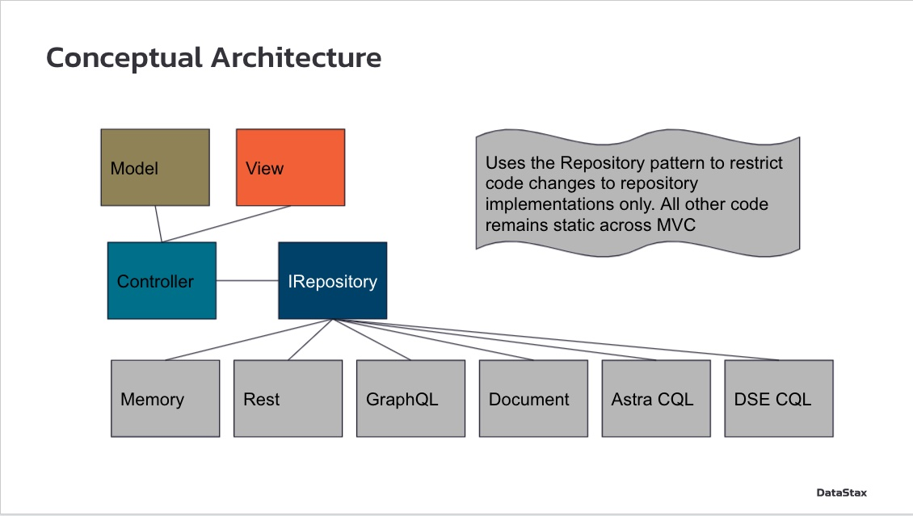
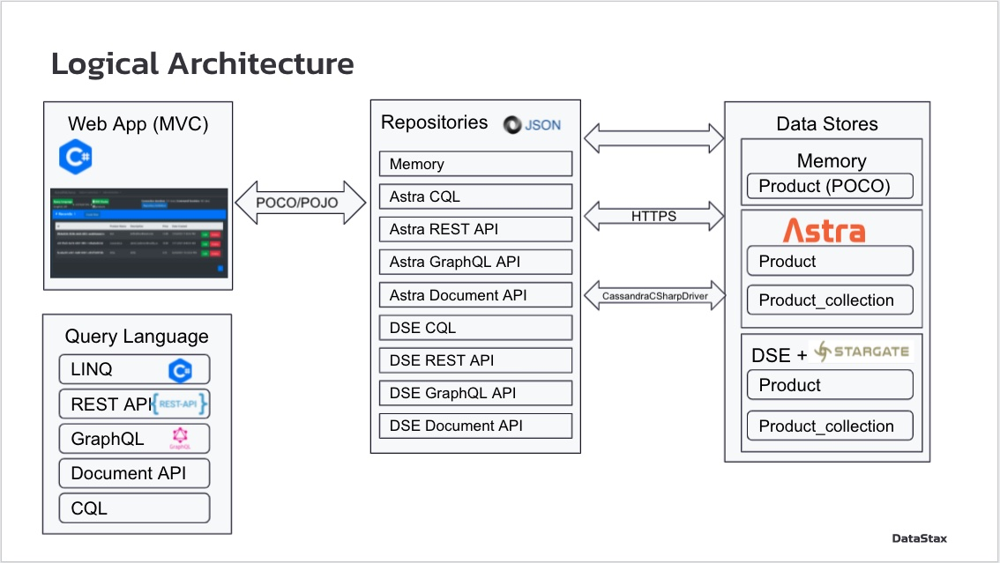
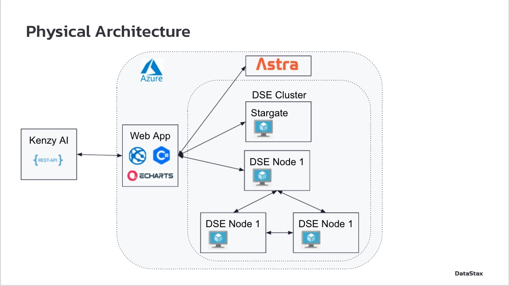
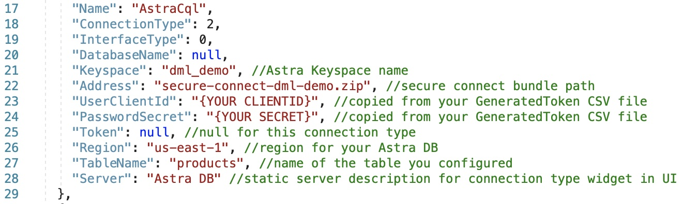
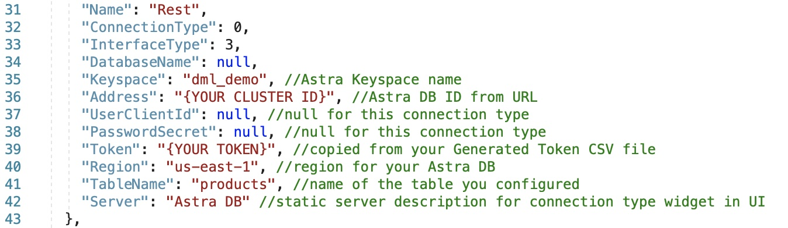
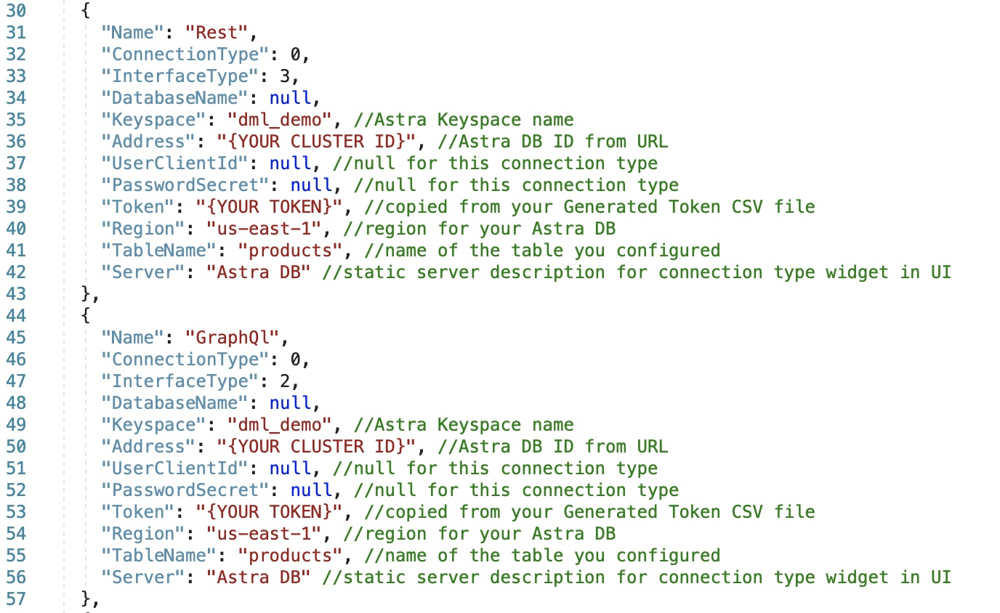
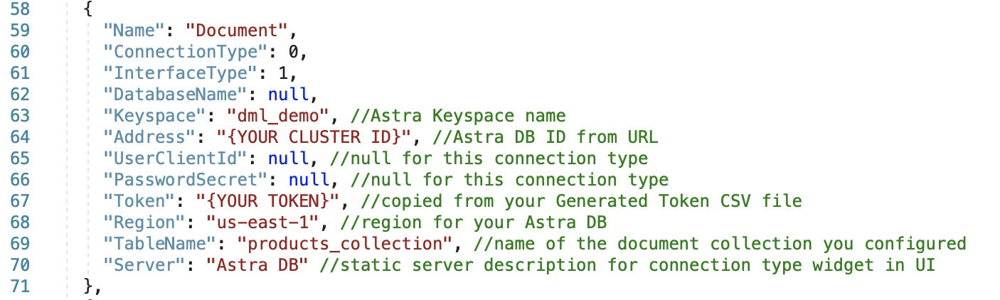

# Data Manipulation Layer Tool

Data can be hard to access, and it's rarely presented in a developer friendly way. The goal of this tool is to provide implemented examples of accessing the same central data layer via a service layer that allows you to interact with your data via the connection type that is most intuitive to you. We've fully implemented CRUD operations for each of the connection types, so you can focus on developing the next feature for your business or project and leave the data layer to DataStax, the easiest, most robust, and fastest data lane on the planet. 


## Overview

This tool has been designed by Data Architects at DataStax to showcase the power of *[Astra](https://astra.datastax.com)*, a DBaaS built on Cassandra and *[Stargate](https://stargate.io)*, an API gateway that provides secure access to. This gateway supports connections via REST, GRAPHQL, and schemaless Document APIs. The C# driver is also imlpemented to showcase connecting to your data via CQL queries. This demo shows the ease with which you can access your data the way you want any way you want it. 

### Architectures



As you can see, this application is written using a Model-View-Controller architecture framework to implement a product inventory management system. The Model, View, and Controller code remain the same regardless of the API interface selected. This is achieved using a distinct Repository implementation per API option to contain the code changes and maximize extensibility of the framework. 



The web application communicates with the repositories, which expose the data object as a plain old class object (POCO). The repository implements the IRepository interface that exposes the following methods: 1) ```AddProduct(product)```; 2) ```GetProduct(id)```; 3) ```GetAllProducts()```; 4) ```UpdateProduct(product)```; and 5) ```DeleteProduct(id)```. Each repository uses a different query language to manipulate data in a data store. There are three data stores that are accessed by the demo: 1) Memory; 2) Astra; and 3) DSE cluster with Stargate



This is a Cloud native application which demonstrates the ability to use DBaaS and IaaS in concert to rapidly implement the solutions. In the steps below, we outline how to leverage Astra for FREE and in minutes as the data store for this demo. 
*(Optional)* Lifecycle Manager is used to install and configure a three-node DSE cluster, with Stargate on a seperate VM.

## Getting Started

### 0. Pre-requisites

1. C# IDE - This tool was created using Microsoft Visual Studio, and half of the value of showing the ease of development. 
2. BYO Astra DB *(FREE)*- create an [Astra DB account](https://astra.datastax.com) for $25 a month of FREE access.
3. BYO On-premises DSE & Stargate implementation (optional) - we've implemented all the code you need to be able to connect to an existing DSE instance via Stargate API Gateway. 

### 1. Setup your Database

#### Create Database
Navigate to [Astra](https://astra.datastax.com) and create DB (if you don't already have one). Enter a Name for your Database and `dml_demo` for your Keyspace Name then select your region. Select Create Database. *Reminder* DataStax provides $25 monthly credit. 


YAY!!! You have a DB, now what?? You need to create a Table. 

#### Create Table (CQL, Rest, GraphQL)
Cassandra needs a schema to initialize the database table. To set this up, leverage cqlsh in Astra and against your On-premises DSE to copy and execute the following commands and create the `products` table:

```
use dml_demo;
```

```
create table products ( id uuid, productname text, description text, price decimal, created timestamp, field1 text, field2 text, field3 text, field4 text, field5 text, field6 text, field7 text, field8 text, field9 text, field10 text, primary key (id));
```

In Astra, you will select your database and navigate to the CQL Console tab:


As shown in the image, run `describe products;` to confirm the schema is as expected. 

#### Create Collection (Schemaless Documents)

Interacting with schemaless documents must be done inside of a collection which is separate and apart from the `products` table. When you run the application for the first time, the tool will detect that the collection does not exist and will call an API to initialize this collection for you. 

#### Download the Secure Bundle

The C# Driver relies on a Secure Connect Bundle. In Astra, download the zip file for your region from the Connect tab and select the C# option under the 'Connect using a driver' separator.


Save this zip file as we will use it later. 

#### Generate Auth Token for API (Astra Only)

*Note: This step is just for Astra setup, we have code in our solution to handle the `GetToken` operations for on-premises DSE with Stargate.* 

Now that we have our table, we need to grab an auth token from the Astra UI. Go to *Organization Settings > Token Managemnt > Select Role > Administrator Service Account > Generate Token* to create your API auth token. 


The token information is now displayed in the UI and select *Download the CSV* to save the sensitive information. We will use this to configure our tool for APi authentication in the later steps. 

### 2. Pull this repository and Configure 

With that setup out of the way, it's time to pull this repository. Next, we need to setup the tool with the definitions of our database (respositories) to make sure that it can connect properly. We hope we've made this pretty easy for you. :)

#### Add Astra security bundle to the solution
Download the security bundle from your Astra account and include the file in the root level of the c# project.


#### Configure Repository Definitions

Just navigate to the `RepositoryDefinitions.json` within the project directory and take a look at the settings that define each of the connection types. We need to make some changes here to configure our tool properly. 

First find the `AstraCQL` section, make sure that the `Keyspace` name and `Region`matches what you've configured in your Astra DB. To do this go to your Databases Landing Page as shown below to confirm. In this case, `dml_demo` is correct. 


Under `Address`, make sure this reflects the path to the Secure Connect Bundle you downloaded earlier in Step 1. For `UserClientID` and `PasswordSecret`, make sure those match what is in your GeneratedToken file from the Token CSV file we downloaded earlier. After you've made these changes, it should look like this with your specific bundle path, clientid, and secret information:



Next we will update the definition for the REST API section. The `Keyspace` and `Region` information will be the same, so we just need to copy and paste to make sure there are no differences there. Then we need to make sure that the `Address` matches the Cluster ID from our Databases Landing Page. Finally, we need to copy the `Token` from Token CSV.  



The GraphQL API uses the same configuration and should be the exact same as the REST API section, so you can updated those sections with the same details. 



The Document API uses a similar configuration, but will need to point to the reference of the collection for the `Table Name`. 



Setting up the connection types for on-premises DSE follows a very similar structure with the main difference being that you need to specify the Cluster URL in the `Address` field. 

#### Configure the sentiment analytics

Create a free account at Kenzy AI here: https://kenzyai.com/. Once logged in, create an API Key. Update the appsettings.json file entry with the API Key --> "Astra"."KenzyAiKey".


The setup is complete and you're ready to get rolling now!

### 3. Build and Run to play around Creating, Reading, Updating and Deleting

Finally, Build and Run the application.


